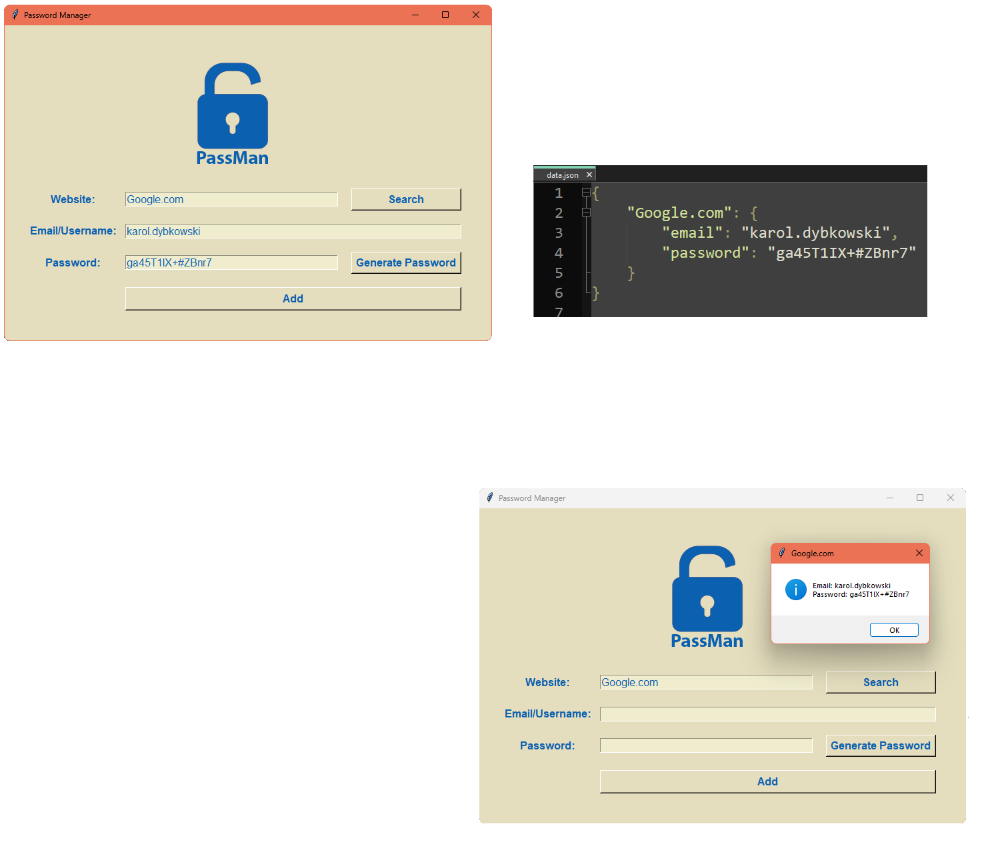

# Password Manager

Program which stores passwords in json file. Can even generate passwords or search existing login credentails.
## Used technologies/frameworks/libraries/languages
Python 3.11, tkinter, json,  pyperclip 1.9.0, PyInstaller 6.11.1
## Installation
Download folder "client" and run "Password-Manager.exe". You need to have Python installed on your machine to run this application.
## License
This project is licensed under the MIT License.
